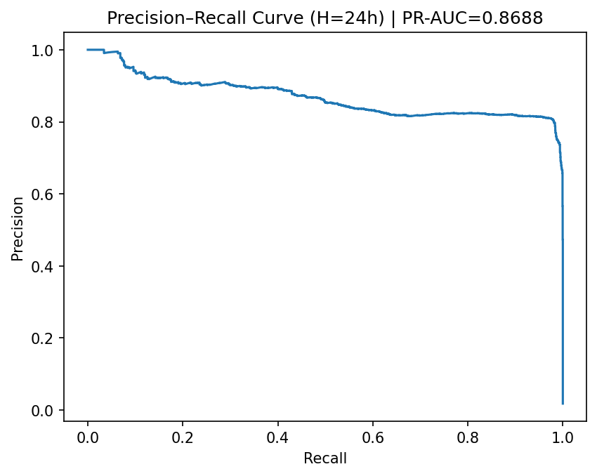
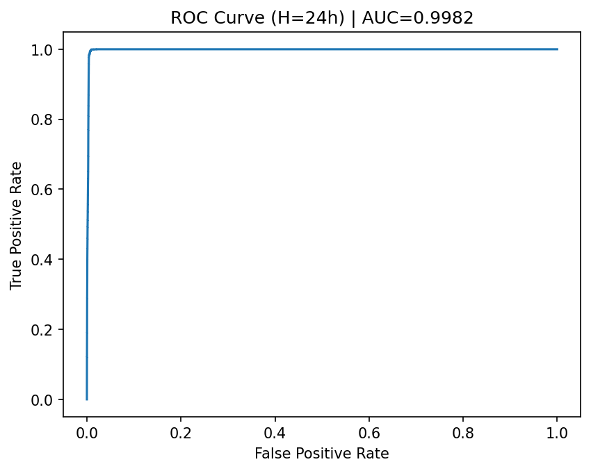
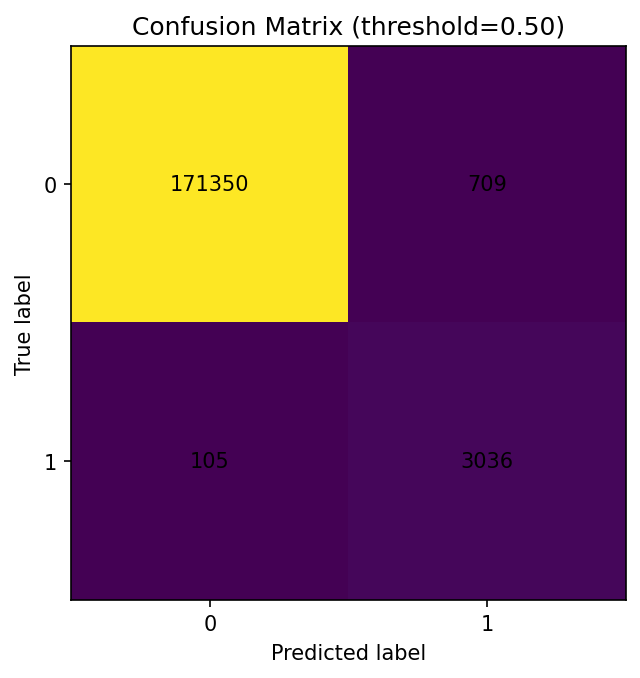

# Predictive Maintenance Using Time-Series Machine Data

## Overview
This project implements an end-to-end **predictive maintenance (PdM)** pipeline to forecast whether an industrial machine will **fail within the next 24 hours**, using historical telemetry, error, and maintenance logs.

The work was originally prototyped in **PySpark** and then fully **migrated to pandas and scikit-learn** to enable local development, reproducibility, and easier experimentation—while preserving the original modeling logic and time-based assumptions.

The final solution demonstrates:
- Robust feature engineering on time-series data
- Correct time-aware train/test splitting
- Handling of extreme class imbalance
- Strong, interpretable performance using gradient-boosted decision trees

---

## Business Problem
Unplanned equipment failures are costly and disruptive.  
The goal is to **predict imminent failures** so maintenance can be scheduled proactively, reducing downtime and operational risk.

We frame the task as a **binary classification problem**:

> **Will a machine fail within the next 24 hours?**

---

## Dataset
The project uses a public industrial predictive maintenance dataset containing:
- Hourly telemetry readings (sensor measurements)
- Error logs
- Maintenance records
- Machine metadata

Failures are **rare events** (~2% of time windows), which reflects real industrial conditions and motivates the use of appropriate evaluation metrics.

---

## Project Structure
Predictive Maintenance/
│
├── data/
│ ├── PdM_telemetry.csv
│ ├── PdM_errors.csv
│ ├── PdM_maint.csv
│ ├── PdM_failures.csv
│ └── PdM_machines.csv
│
├── notebook/
│ ├── data_prep.py # Feature generation & labeling (pandas)
│ ├── feature_eng.py # Per-machine feature engineering
│ └── model.py # Modeling, evaluation, and plots
│
├── reports/
│ ├── roc_curve_h24.png
│ ├── pr_curve_h24.png
│ └── confusion_matrix_h24_t0_5.png
│
└── README.md

Generated feature files are excluded from version control to keep the repository lightweight and reproducible.

---

## Feature Engineering
For each machine and timestamp, features are computed using **only historical data**:

### Sensor-based features (rolling 24 hours)
- Mean, standard deviation, min, max
- First-order differences (deltas)

### Event-based features
- Number of errors in the last 24 hours
- Number of maintenance actions in the last 24 hours

### Label definition
A binary label is assigned:
- `1` → a failure occurs within the next 24 hours  
- `0` → no failure within the next 24 hours

This formulation avoids **label leakage** by strictly respecting temporal causality.

---

## Train/Test Split
A **time-based split** is used:
- First 80% of the timeline → training
- Last 20% of the timeline → testing

This simulates a realistic deployment scenario where models are trained on historical data and evaluated on future periods.

> Note: Machines are **not held out** between train and test.  
> The model is intended to forecast future behavior of **known machines**, which matches many real industrial PdM use cases.

---

## Model
- **Algorithm**: Histogram-based Gradient Boosted Trees  
  (`HistGradientBoostingClassifier`, scikit-learn)
- Chosen for:
  - Strong performance on tabular data
  - Fast training on large datasets
  - Similar inductive bias to Spark’s GBTClassifier

---

## Evaluation Metrics
Given the strong class imbalance, multiple complementary metrics are used:

### ROC-AUC
- **ROC-AUC (24h horizon)**: **0.998**

### Precision–Recall (primary metric)
- **PR-AUC (24h horizon)**: **0.869**

PR-AUC is emphasized because it better reflects performance on rare-event detection.

### Confusion Matrix (threshold = 0.5)
- Recall (failure): **96.7%**
- Precision (failure): **81.1%**
- Missed failures: **~3.3%**

This represents a strong operational trade-off between catching failures and limiting false alarms.

---

## Visual Results

### Precision–Recall Curve (Primary)

### ROC Curve

### Confusion Matrix

---

## Key Takeaways
- Strong predictive signals exist shortly before failures
- Time-aware feature engineering is critical for PdM
- PR-AUC provides more insight than accuracy for rare events
- Gradient-boosted trees are highly effective for structured industrial data

---

## Tools & Technologies
- Python
- pandas, NumPy
- scikit-learn
- matplotlib
- VS Code
- Git/GitHub

---

## Possible Extensions
- Evaluate longer prediction horizons (48h, 72h)
- Threshold optimization based on business cost
- Machine-level holdout to test generalization
- Feature importance and SHAP analysis
- Real-time inference simulation

---

